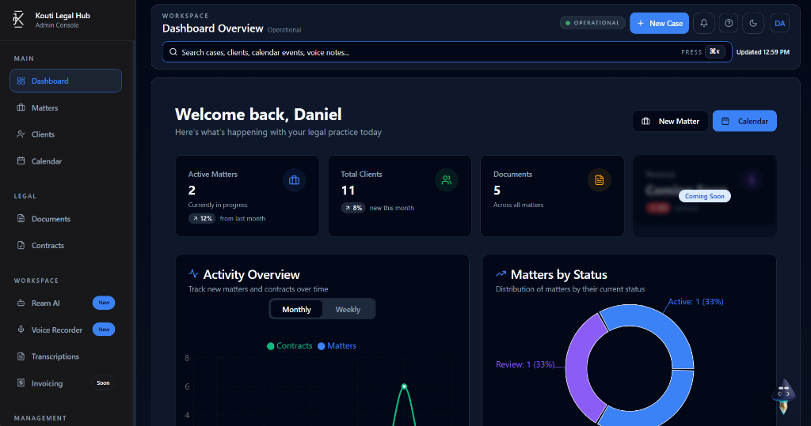

<div align="center">
  

  <h1>Kourti Legal</h1>

  <p><strong>The open-source workspace for matters, documents, clients, and deadlines.</strong></p>

  <p>
    <a href="https://github.com/boyeesu/Kourti/actions/workflows/ci.yml"></a>
    <a href="LICENSE"></a>
    
    <a href="SECURITY.md"></a>
    <a href="https://kourti.com"></a>
  </p>

  <p>
    <a href="#quickstart">Quickstart</a> ·
    <a href="#what-kourti-does">What it does</a> ·
    <a href="#self-hosting">Self-hosting</a> ·
    <a href="#development">Development</a> ·
    <a href="#community">Community</a>
  </p>
</div>



> **Kourti Legal is software, not legal advice.** AI-generated content can be
> inaccurate and must be reviewed by a qualified professional before it is
> relied upon or shared.

## Quickstart

Run the complete local stack—React app, Node API, and PostgreSQL—with Docker:

```sh
git clone https://github.com/boyeesu/Kourti.git
cd Kourti
cp .env.example .env
cp backend-node/.env.example backend-node/.env
docker compose up --build
```

Open [localhost:8080](http://localhost:8080). The API health check is available
at [localhost:4000/health](http://localhost:4000/health).

The supplied defaults are for a local machine only. Before any public
deployment, use `AUTH_MODE=custom`, strong distinct JWT secrets, TLS,
restricted CORS origins, a production database, and persistent object storage.

## What Kourti does

| Workspace                                                                               | Intelligence                                                                             | Operations                                                                                |
| --------------------------------------------------------------------------------------- | ---------------------------------------------------------------------------------------- | ----------------------------------------------------------------------------------------- |
| Matters, clients, documents, contracts, tasks, calendars, invoices, and a client portal | AI-assisted drafting, review, comparison, risk extraction, and legal-workflow automation | Role-based access, audit-focused admin, notifications, SSO, payments, and team management |

Kourti is built with React/Vite, TypeScript, Node/Express, PostgreSQL, and
Docker Compose. Optional integrations include AI providers, Resend,
S3-compatible storage, ClamAV, SSO, and Paystack.

## Self-hosting

Kourti can run behind a TLS reverse proxy with PostgreSQL and persistent
storage. Operators are responsible for access control, backups, key management,
updates, and applicable professional, privacy, and data-residency obligations.

- [Docker setup](docs/docker-local-setup.md)
- [Environment reference](docs/ENVIRONMENT.md)
- [Database bootstrap](APPLY_MIGRATIONS.md)
- [CI/CD security and release controls](docs/CI_CD_SECURITY.md)

## Development

Requirements: Node.js 22+, npm, and PostgreSQL 16+.

```sh
# frontend
npm ci
npm run dev

# in another terminal: backend
cd backend-node
cp .env.example .env
npm ci
npm run dev
```

Set `DATABASE_URL` in `backend-node/.env` to a local PostgreSQL instance. The
backend bootstraps its schema in development; see [APPLY_MIGRATIONS.md](APPLY_MIGRATIONS.md).

Run the checks before opening a pull request:

```sh
npm test
npm run lint
npm run build

cd backend-node && npm run build
```

## Configuration

- `.env.example` contains browser-safe Vite configuration only.
- `backend-node/.env.example` documents database, auth, AI, email, storage,
  payment, and server-side security settings.
- Never put a secret in a `VITE_*` value: Vite embeds it in the browser bundle.
- Do not point a local environment at a production database.

## Community

| Contribute                         | Get help                 | Report security            | Project decisions              |
| ---------------------------------- | ------------------------ | -------------------------- | ------------------------------ |
| [CONTRIBUTING.md](CONTRIBUTING.md) | [SUPPORT.md](SUPPORT.md) | [SECURITY.md](SECURITY.md) | [GOVERNANCE.md](GOVERNANCE.md) |

Please also read the [Code of Conduct](CODE_OF_CONDUCT.md), [AI Policy](docs/ai-policy.md),
and [third-party notices](THIRD_PARTY_NOTICES.md).

## License and trademarks

Kourti Legal source code is released under the [MIT License](LICENSE). The
Kourti name and logos are not licensed for use as your own brand; see
[TRADEMARKS.md](TRADEMARKS.md).
